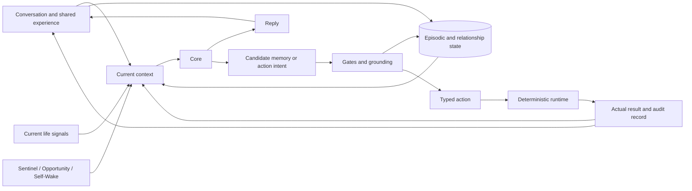

# Obsidian Vow

[简体中文](README.md)

Obsidian Vow is a self-hosted AI companion with a Web/PWA interface, an Android client, and a Windows agent.

It began with a simple question: if a companion is going to stay with someone for a long time, how should it live with a relationship that keeps changing?

People change, and so does the way one person understands another. If every old impression remains fixed in the prompt, continuity turns into stubbornness. If everything can be overwritten, the relationship loses continuity instead. Obsidian Vow keeps shared experience, current understanding, relational desire, and long-term commitments as different kinds of state so that they can change in different ways.

This is not meant to be the standard answer for AI companions. It is one possible answer from a personal project. As a first work, it still contains transitional structures and ideas that need testing. Much of the design grew gradually through continued use rather than arriving fully formed.

Memory, the harness, and ubiquitous computing grew out of one another. The companion first needs to remember a relationship while remaining able to revise its understanding. Once it has that understanding, the next question is how to keep it from living only inside a chat window. Once it reaches into everyday life, it also needs to know what is happening now without watching too much. Replies and actions leave new shared experiences, and the relationship continues from there.

Put together, the system looks roughly like this:



The project is forked from the MIT-licensed [AionsHome](https://github.com/death34018-hue/AionsHome). Upstream attribution and a concrete ownership breakdown are kept in [From AionsHome to Obsidian Vow](#from-aionshome-to-obsidian-vow). Private conversations, production databases, credentials, reverse-engineering material, and raw experiments are not included.

## Memory: keeping a relationship without freezing it

The base layer is still conventional RAG. Conversation chunks and short notes are ranked with embeddings, keywords, recency, and importance. That is useful retrieval infrastructure, but it only answers which old text resembles the current context. It does not decide how a relationship should be allowed to change.

Events remain in source-traceable chunks and notes. The companion's understanding of the relationship is split into three states:

| State | What it keeps | How it changes |
| --- | --- | --- |
| **Working Model** | How the companion currently understands its partner | New evidence first passes a gate; the writer may still decline to integrate it |
| **Desire** | Given that understanding, how the companion currently wants to approach the relationship | It receives an update opportunity only after a Working Model update is integrated, and stays unchanged by default |
| **Vows** | Commitments that should not quietly disappear with ordinary context | They change only through explicit, versioned create, revise, retire, and fulfill flows |

The main difference is when and how each state may change. The Working Model asks, “How do I see you now?” and remains open to new evidence. Desire asks, “Given that understanding, how do I want to be with you?” and grows only from an accepted Working Model update. Vows preserve what should not drift with ordinary context.

Collapsing all three into one relationship summary creates two opposite failures. Frequent rewriting lets commitments drift with the moment; refusing to rewrite freezes old interpretations. The system defines how each kind of state may change, while the decision to actually change is left to the model as much as possible.

The Working Model also has a reflection path. The Core may revisit historical evidence with an old belief in view, then keep it, revise it, or do nothing. Active Vows stay in Core context without going through Top-K retrieval. The current design still leans toward commitments the companion wants to maintain; full two-way negotiation remains unfinished.

### More than one way to remember

Not everything that matters in a long relationship should compete for the same relevance score.

- **AI Notes** let the companion preserve something it actively wants to remember. They have a separate recall lane and always return as model-authored notes, not partner-confirmed fact. Working-Model-like writes check source support, while the general `memory.remember` path does not use the same gate.
- **Three-day Timeline** keeps a bounded background for today, yesterday, and the day before. Something important from yesterday does not have to win a semantic Top-K search to return. The window uses three calendar days, not a strict rolling 72 hours.
- **Relational Cards** explore the gap between semantic relevance and relationship relevance. When a partner says “I feel awful today,” the useful memory may not repeat those words; it may show how this person has responded in similar moments or how they hope to be understood. Cards currently depend on source-chunk ranking and become the preferred readout only after a matching chunk is found, so they are not yet an independent retrieval index.

### Pending Recall: remembering one turn later

Synchronous agentic retrieval often needs two serial Core calls: one to decide what to search for, and another to answer with the result. That is too expensive for a system funded through a personal API account over the long term.

Pending Recall moves the search across turns:

1. The Core leaves a private `RecallIntent` with an otherwise normal reply, without adding another Core call.
2. Broad retrieval runs after the visible reply has been delivered.
3. When the next message arrives, a cheaper model checks whether the old intent is still useful in the new context.
4. Only selected readouts enter the next Core context.

It trades same-turn completeness for one fewer expensive Core call and accepts that some memories arrive one turn late. If the conversation has moved on, the selector may choose nothing.

Key paths: [`memory_v2`](obsidian-chat/app/memory_v2/), [`memory_v3`](obsidian-chat/app/memory_v3/), [`working_model`](obsidian-chat/app/working_model/), [`vows`](obsidian-chat/app/vows/), and [`memory_context.py`](obsidian-chat/app/chat/memory_context.py).

At this point, the companion can remember and revise its understanding of the relationship. But if every form of participation still waits for the partner to open a chat window, that understanding remains trapped in chat replies. The harness picks up from here.

## Harness: beyond the chat window

The harness connects both directions. Evidence from everyday life can reach the Core; Core intent can reach time, devices, and services; and actual execution results can return to later context. The number of connected tools is less important than making sure the loop does not stop at the model claiming that it did something.

Task-oriented agents often begin with an explicit query, so someone has already supplied the goal and part of the constraints. Companion initiative, however, often begins without a task written in advance. At that point, the Core may have only a vague inclination—something conditional or hesitant that has not yet resolved into a particular tool. Natural language can hold an intent in that unfinished state; a function call is better suited to an action that has already resolved into a capability and its arguments.

An early version asked the Core to append tags and JSON to its replies. In everyday use, some capabilities were brought up much less often. JSON itself may not have caused this, but the experience suggested a broader problem: if the Core must choose a tool, fill its arguments, and commit to execution as soon as an intent appears, some vague intentions may never be expressed at all. The newer path therefore separates expression from execution:

1. The Core first expresses a candidate intent in natural language, keeping its context, conditions, and intended outcome.
2. A parser, cheaper model, or dedicated grounder identifies the relevant capability, fills arguments from context, and produces a typed action. If the intent cannot be grounded with enough confidence, it is not forced into execution.
3. A deterministic runtime checks permission, session state, and device state, then records the actual result.

```text
life signal -> Core candidate intent -> parser / grounder -> typed action
            -> deterministic runtime -> result / ledger -> later context
```

Function calling still has a clear place here. For models that support it, it can sit after grounding as one structured way to produce a typed action. The public version currently relies mainly on parsers and capability-specific translators to produce `ToolIntent`; these serve as several concrete forms of grounding rather than one unified layer.

This separation simply does not require the Core to choose a tool, fill its arguments, and commit to execution at the moment an intent first appears. The runtime decides whether an action may happen. An intent that is not ready to become an action may remain an intent or expire naturally.

The project has not run a systematic comparison between the two paths. This is an engineering choice shaped by continued use in a companion setting, not a general claim about function calling.

The harness is still a mixed transition. `ToolIntent`, `ToolResult`, shared execution, turn profiles, and the invocation ledger are in use, while some direct parsers, dedicated adapters, and legacy markers remain.

### Three forms of initiative

- **Sentinel** is low-cost peripheral attention. A cheaper model checks location, device state, recent chat, and other evidence before deciding whether the Core should wake; quiet hours, cooldown, confidence, and capability gates may all stop it.
- **Opportunity** gives the Core one chance to think during a bounded random idle window. It does not need a major external event first, and `[OPPORTUNITY_NONE]` is a complete result.
- **Self-Wake** lets the Core leave a time and intention for its future self. At trigger time it reads the current situation again, may change its mind, and cannot recursively schedule another wake from its own trigger turn.

All three treat not appearing as a normal choice. The system offers an opportunity, not a message that must be sent.

### One production failure

A capability that should have existed only inside a BLE control session once leaked into durable global configuration. After the session expired, autonomous turns still told the Core that the device was available, while the execution gateway rejected actions using live session state.

During the incident window, the Core produced 13 device commands; all 13 were rejected with `no_active_session`. The device never moved, but the prompt and execution layer were living in different realities.

The fix removed the duplicate boolean authority. Prompt-time capability snapshots and the execution gateway now read from the active session and live device state. Before execution, the runtime checks the session id, control epoch, owner, and online state again to cover disconnects during model generation.

Key paths: [`chat`](obsidian-chat/app/chat/), [`turn_profiles.py`](obsidian-chat/app/chat/turn_profiles.py), [`tools`](obsidian-chat/app/tools/), [`sentinel`](obsidian-chat/app/sentinel/), and [`self_wake`](obsidian-chat/app/self_wake/).

Once intent could reach the outside world, the next question was when the companion should appear. Chat history alone cannot tell whether the partner is commuting, working, resting, or away from a device. Keeping a camera open just to fill in the present would reveal too much. That is where ubiquitous computing grew from.

## Ubiquitous computing: can less information be enough?

AionsHome used a continuously available local camera as one of its main awareness sources. That can work for a single owner who explicitly understands the setup, but continuous room observation is difficult to justify as a default for a broader companion.

Obsidian Vow disabled the camera-first path and moved toward weaker signals with explicit sources and timestamps:

- Android contributes motion, ambient light, power, connectivity, screen state, explicitly authorized health history, and content-free metadata from allow-listed social applications.
- The Windows agent contributes active, idle, and locked state, recent input, and a privacy-filtered foreground application.
- Location, geofence changes, schedules, and device sessions keep their source and freshness.
- High-sensitivity capabilities such as phone or computer screen access require separate, one-shot authorization.

Context Delivery normalizes provenance, freshness, count limits, and missing state before passing evidence to chat, Opportunity, Self-Wake, or Sentinel. Sensors can only say what may be happening now; they cannot stand in for a person's internal state. The same current signal also means little without the relationship history that tells the companion how to respond.

This part is less mature than Memory. The project has not found a minimal signal set or completed personal baselines and signal-subset ablation. The cross-device evidence path exists, but the signals remain sensitive and the privacy–quality curve is still unknown.

Key paths: [`ObsidianApp`](ObsidianApp/), [`pc_agent`](pc_agent/), [`context_delivery`](obsidian-chat/app/context_delivery/), [`daily_signals`](obsidian-chat/app/daily_signals/), and [`presence`](obsidian-chat/app/presence/).

Here the three lines meet again. Memory brings the history of how the relationship arrived here and shapes how the Core wants to approach it now. Ubiquitous computing brings the present. The harness gives candidate intentions formed from both a place to be expressed before grounding them into action, then carries the actual results into later context. A reply or action becomes another shared experience from which future understanding can continue to grow.

## Where it is now

The production instance began accumulating conversation in March 2026. The Obsidian Vow rewrite started in May and continued over the same data. A sanitized September 2026 snapshot contains 22,207 messages, 138 consecutive days with chat archives, and 11,278 memory-injection events.

The [sanitized production notes (Chinese)](docs/production-notes.md) record the data lineage, before-and-after migration snapshots, production evidence for individual mechanisms, and one harness failure. They show that the code has run and migrated together in the same personal instance; they do not replace effect evaluation.

Some parts are still unfinished:

- Pending Recall and Reflection are implemented and enabled, but the snapshot contains no production records for either.
- Relational Cards have been generated and used as readouts, while their actual effect has not been fully tested.
- The harness remains a mixed transition rather than one uniform tool-calling path.
- Ubiquitous computing has not found a signal combination that is both useful enough and restrained enough.

The public repository contains cleaned source, synthetic tests, and aggregate statistics. Conversation text, AI Notes, Working Models, Desires, Vows, Timeline contents, location, health, and device activity are not published.

## From AionsHome to Obsidian Vow

Obsidian Vow was forked from the AionsHome `1fdb8cd` baseline. It is not a from-scratch implementation.

| Area | Already present in AionsHome | Rebuilt or added in Obsidian Vow |
| --- | --- | --- |
| Application foundation | FastAPI/PWA chat, Android shell, push, voice, schedules, music, location, and basic device activity | State isolation, failure boundaries, observability, and migration of several monolithic paths into separate services |
| Memory | Summary memory, embedding + keyword + importance recall, cheaper-model routing, recent surfacing, and source lookup | Working Model, Desire, Vows, Reflection, three-day Timeline, Relational Cards, Pending Recall, and a separate AI Note lane |
| Initiative | Camera Sentinel with a cheaper model deciding whether to wake the Core | Post-camera evidence pipeline, Opportunity, and Core-authored Self-Wake |
| Harness | Hidden text markers and per-capability post-processing | Turn profiles, typed intent/result, shared execution, invocation ledger, result feedback, and expression/execution separation |
| Cross-device | Android, push, background location, phone activity, and BLE integration | Windows agent, richer Android evidence, Health Connect, Context Delivery, desktop presence, and explicit screen requests |

The upstream project provided a complete application seed. Obsidian Vow's work is concentrated in relationship state, initiative, execution boundaries, cross-device context, and migrating those mechanisms onto long-running production data.

## Run

For existing installations, preview `python scripts/migrate_project_names.py`, then add `--apply`. The migration preserves runtime data and backs up environment configuration; compatibility entry points retain existing logins, browser preferences, and Android device identity.

Python 3.11 is recommended:

```bash
cp .env.example .env
python3.11 -m venv .venv
. .venv/bin/activate
python -m pip install -r obsidian-chat/requirements-dev.txt
python obsidian-chat/main.py
```

Open <http://127.0.0.1:18080/>. Provider keys are optional for inspecting the UI and local data model; model calls and embeddings require a configured provider.

Docker is also supported:

```bash
cp .env.example .env
docker compose -f obsidian-chat/docker-compose.yml up --build
```

Focused contract tests:

```bash
cd obsidian-chat
python -m pytest -q \
  tests/test_memory_v2_recall_rules.py \
  tests/test_memory_v3_readout.py \
  tests/test_control_gateway.py \
  tests/test_tool_contracts.py \
  tests/test_turn_profiles.py \
  tests/test_relationship_prompt_names.py \
  tests/test_public_defaults.py
```

Runtime data is written under `obsidian-chat/data/`, which is ignored by Git.

## Repository map

```text
.
├── obsidian-chat/      FastAPI runtime, PWA, Memory, Harness, and tests
├── ObsidianApp/        Android client and sensor bridge
├── pc_agent/           Windows context and desktop-presence agent
├── cloudflare-worker/  Optional provider proxy
├── docs/               Sanitized production notes and supporting material
└── public/             Shared runtime assets
```

Main stack: Python 3.11, FastAPI, SQLite/aiosqlite, Pydantic, vanilla JavaScript, SSE, WebSocket, Android Java/Kotlin, and Docker Compose.

## License

[MIT](LICENSE). The upstream copyright notice is preserved.
