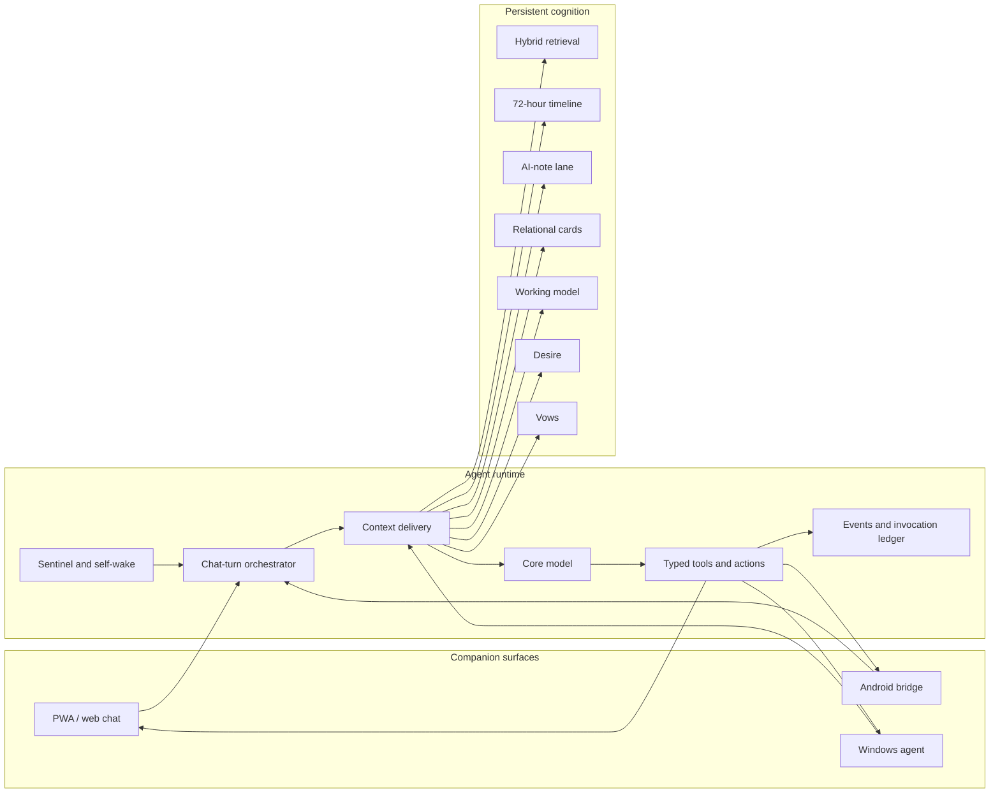

# Obsidian Vow

**A self-hosted AI companion that remembers, acts, and stays present across devices.**

Obsidian Vow is a single-owner companion system built around three engineering problems:

1. **Memory** — turning a long relationship history into bounded, provenance-aware context.
2. **Agent harness** — turning model output into reliable, observable actions and background work.
3. **Ubiquitous computing** — connecting the companion to mobile, desktop, location, health, schedules, and ambient presence.

This is the cleaned source release of a running personal system. Private conversations, production databases, credentials, reverse-engineering material, raw experiment data, and internal work logs are intentionally excluded.

## System at a glance



## 1. Memory: persistent cognition, not a vector-store wrapper

The memory system separates different kinds of state because they have different evidence, update, and prompt-injection rules.

| Layer | Responsibility | Update/read contract |
| --- | --- | --- |
| Conversation chunks and factual notes | Durable episodic evidence | Hybrid semantic, lexical, recency, and importance retrieval |
| 72-hour timeline | Recent chronological continuity | Compact, versioned summary rendered separately from long-term recall |
| AI notes | Companion-authored observations | Independent retrieval lane and prompt budget |
| Relational cards | Evidence-backed interpretation of relationship episodes | Versioned generation, supersession, invalidation, and source hashes |
| Working model | Current understanding of the owner and the relationship | Conservative gated writes; current expression overrides stale memory |
| Desire | The companion's current persistent motivational state | Small independent budget and explicit update path |
| Vows | Durable commitments | Explicit lifecycle: create, revise, retire, and fulfill |

Retrieval and injection are deliberately separate. Candidates must pass prompt eligibility, visible-source exclusion, lane budgets, score thresholds, deduplication, and total character limits before they enter model context. Injection events record route, source, version, score, rank, latency, and outcome for later diagnosis.

### Cross-turn asynchronous recall

When the current answer reveals that a deeper memory may matter on the next turn, the model can emit a private `RecallIntent`. The runtime persists it, performs wide retrieval asynchronously, and later runs a bounded selector against the next user message.

The workflow has explicit `queued`, `ready`, `selected`, `consumed`, `superseded`, `cancelled`, and `failed` states, along with timeout, retry, defer, and one-shot consumption semantics. This keeps slow retrieval outside the critical response path without letting stale results leak into the wrong turn.

Key code:

- [`app/memory_v2/`](aion-chat/app/memory_v2/) — storage, embeddings, hybrid recall, eligibility, and prompt rendering
- [`app/memory_v3/`](aion-chat/app/memory_v3/) — timelines, relational cards, provenance, and pending recall
- [`app/working_model/`](aion-chat/app/working_model/) — gated persistent understanding
- [`app/desire/`](aion-chat/app/desire/) and [`app/vows/`](aion-chat/app/vows/) — persistent inner state and commitments
- [`app/chat/memory_context.py`](aion-chat/app/chat/memory_context.py) — chat-turn integration

## 2. Agent harness: reliable work around an unreliable model

The harness treats model output as an untrusted proposal rather than an action. It provides:

- a chat-turn pipeline shared by normal conversation, regeneration, and autonomous wake-ups;
- typed tool schemas, parsing, validation, execution, feedback, and an invocation ledger;
- private control markers that are removed before user-visible output;
- context projection with per-source policy, safety checks, prompt budgets, and shadow comparison;
- durable events and explicit side-effect boundaries;
- Sentinel, reflection, scheduling, and self-wake paths for background initiative;
- fail-closed behavior for malformed model output and incomplete relationship context;
- feature flags, staged rollout paths, and replayable tests for behavior changes.

The same Core model therefore sees one coherent capability surface regardless of whether a turn began in chat, from a schedule, from sensor evidence, or from an autonomous wake-up.

Key code:

- [`app/chat/`](aion-chat/app/chat/) — turn orchestration, streaming, prompt construction, and side effects
- [`app/context_delivery/`](aion-chat/app/context_delivery/) — typed projection and rendering of runtime context
- [`app/tools/`](aion-chat/app/tools/) — tool contracts, execution, feedback, and ledger
- [`app/sentinel/`](aion-chat/app/sentinel/), [`app/self_wake/`](aion-chat/app/self_wake/), and [`app/reflection/`](aion-chat/app/reflection/) — autonomous paths

## 3. Ubiquitous computing: one companion, multiple physical contexts

Obsidian Vow is designed as a distributed personal system rather than a single chat page.

- The FastAPI service owns conversations, memory, orchestration, SSE streaming, and WebSocket synchronization.
- The responsive PWA provides chat, memory inspection, schedules, settings, activity logs, device state, and presence controls without a frontend framework.
- The Android bridge adds native audio capture, push delivery, alarms, Health Connect history, sensing, and foreground-service continuity.
- The Windows agent contributes foreground activity, screen context, presence playback, and an explicit summon surface.
- Location, daily signals, schedules, devices, and presence are converted into typed evidence before they can reach Core.

These adapters do not inject raw sensor streams directly into the model. They report through capability-specific services and the shared context-delivery boundary, keeping provenance and relationship-safe naming intact.

Key code:

- [`AionApp/`](AionApp/) — Android integration layer
- [`pc_agent/`](pc_agent/) — Windows-side context and presence agent
- [`app/presence/`](aion-chat/app/presence/), [`app/daily_signals/`](aion-chat/app/daily_signals/), and [`app/location/`](aion-chat/app/location/) — ambient context services
- [`static/`](aion-chat/static/) — dependency-light PWA frontend

## Stack

- **Backend:** Python 3.11, FastAPI, SQLite/aiosqlite, Pydantic, httpx
- **Retrieval:** Gemini embeddings, NumPy scoring, lexical and temporal signals
- **Frontend:** HTML, CSS, vanilla JavaScript, SSE, WebSocket, PWA
- **Mobile:** Android Java/Kotlin, WebView, foreground services, Health Connect
- **Desktop:** Python Windows agent
- **Deployment:** Docker Compose with a persistent local data volume

## Run locally

Python 3.11 is recommended.

```bash
cp .env.example .env
python3.11 -m venv .venv
. .venv/bin/activate
python -m pip install -r aion-chat/requirements.txt
python aion-chat/main.py
```

Then open <http://127.0.0.1:18080/>. Provider keys are optional for inspecting the UI and local data model, but model calls and embeddings require a configured provider.

Or use Docker:

```bash
cp .env.example .env
docker compose -f aion-chat/docker-compose.yml up --build
```

Runtime state is stored under `aion-chat/data/` and ignored by Git.

## Repository layout

```text
.
├── aion-chat/          FastAPI runtime, PWA, memory, harness, and tests
├── AionApp/            Android bridge
├── pc_agent/           Windows context and presence agent
├── cloudflare-worker/  Optional provider proxy
└── public/             Optimized runtime assets
```

## Project scope

Obsidian Vow is an owner-operated system, not a multi-tenant SaaS product. Its engineering choices optimize for a long-running private relationship, local control, reversible rollout, and inspectable behavior. The repository demonstrates a complete deployed architecture; it does not claim that each individual memory or agent technique is novel in isolation.

## License

[MIT](LICENSE)
