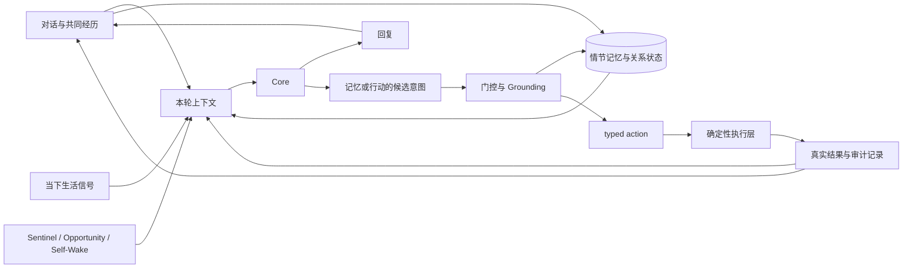

# Obsidian Vow

[English](README.en.md)

Obsidian Vow 是一套自托管 AI companion，包括 Web/PWA、Android 客户端和 Windows agent。

项目从一个很简单的问题开始：如果 companion 真要陪一个人很久，它该怎样面对一段不断变化的关系？

人会变，对一个人的看法也会变。旧印象一直留在 prompt 里，陪伴很容易变成固执；什么都允许覆盖，关系又没有连续性。Obsidian Vow 尝试把共同经历、当前认识、关系欲望和长期承诺分开，让它们按不同的方式变化。

这不是一套 AI companion 的标准答案，只是一个个人项目给出的可能答案。作为第一个作品，它保留着一些过渡结构，也有尚未验证的想法。很多设计不是一次定下来的，而是在持续使用中慢慢长出来的。

Memory、Harness 和普适计算这三条线也是一路接着长出来的：先要让 companion 记得一段关系，又能修改自己的理解；有了这种理解，下一步是别让它只留在聊天框里；真的走进生活以后，又得知道此刻发生了什么，同时别看得太多。回复和行动留下新的共同经历，下一轮关系再从那里继续。

把它们放在一起，大概是下面这条路：



项目 fork 自 MIT 协议的 [AionsHome](https://github.com/death34018-hue/AionsHome)。上游署名与具体继承范围保留在[项目来源](#从-aionshome-到-obsidian-vow)一节。公开仓库不包含私人对话、生产数据库、密钥、逆向材料和原始实验记录。

## Memory：让关系留下，也允许它改变

最底层仍然是常见的 RAG：conversation chunk 和短笔记进入 embedding、关键词、时间与重要度混合排序。这是召回的地基，但它只回答“哪些旧文本与现在相近”，没有处理一段关系该怎样变化。

发生过的事仍留在可以回查来源的 chunk 和 note 中。对这段关系的理解则拆成三层：

| 状态 | 保存什么 | 怎样改变 |
| --- | --- | --- |
| **认识层（Working Model）** | companion 目前怎样理解自己的伴侣 | 新证据先经过 gate，writer 仍可决定不整合 |
| **欲望层（Desire）** | 基于当前认识，它此刻想以什么姿态靠近这段关系 | 只有认识层完成更新时才获得修改机会，默认原样保留 |
| **誓约层（Vows）** | 双方希望长期不被普通上下文冲掉的承诺 | 只通过显式、带版本的创建、修订、退役和履行流程改变 |

三层最主要的区别，是可以怎么改、什么时候改。认识层回答“我现在怎样看你”，允许随着新证据修正；欲望层回答“基于这种认识，我想怎样与你相处”，它只从一次已经成立的认识更新中生长；誓约层保存不该被普通上下文悄悄冲掉的事。

如果把三者合成一段关系摘要，频繁重写会让承诺跟着当下漂移，拒绝重写又会把旧认识固化。这里由系统规定不同状态可以怎样改变，是否真的改变则尽量留给模型判断。

认识层还有一条反思路径。Core 可以先带着旧认识回看历史证据，再决定保留、修正或什么都不做。有效誓约则常驻 Core 上下文，不参加 Top-K 召回。当前实现更偏向保存 companion 自己希望长期维持的关系立场，双向协商还没有做完整。

### 不只一种“想起”

长期关系里需要被记住的内容，并不都适合挤在同一个相关性分数里。

- **AI Notes** 让 companion 主动留下以后还想记得的事。它们拥有独立召回通道，回到上下文时也会标明这是模型过去留下的笔记，不会自动变成伴侣确认过的事实。带认识层含义的写入会检查来源支持，但通用的 `memory.remember` 路径不经过同一套 gate。
- **三日 Timeline** 把今天、昨天和前天整理成一段有界背景。昨天刚发生的事情不必依赖 Top-K 碰运气才能回来。这里按三个自然日计算，不是严格滚动的 72 小时。
- **Relational Cards** 尝试处理“语义相关不等于关系相关”。伴侣说“我今天很难受”时，更有用的往事可能没有复用这些词，而是记录了这个人在类似状态下怎样反应、希望怎样被理解。当前卡片仍依附来源 chunk 排名，命中后才优先展示，因此它是关系视角的 readout，还不是独立检索器。

### Pending Recall：允许晚一轮想起

同步 agentic retrieval 通常需要两次串行 Core 调用：先让模型决定搜什么，再把结果交回模型作答。对一个长期由个人 API 付费的系统，这个代价太高。

Pending Recall 把这次检索拆到两轮之间：

1. Core 在正常回答里留下私有 `RecallIntent`，不增加本轮调用；
2. 回答送达后，后台完成宽召回；
3. 下一条消息到来时，便宜模型结合新上下文判断旧意图是否还有用；
4. 只有被选中的 readout 才进入下一轮 Core 上下文。

它用同轮完整性换掉一次昂贵的 Core 调用，也接受“这件事晚了一轮才想起来”。如果话题已经变化，selector 可以什么都不选。

代码入口：[`memory_v2`](obsidian-chat/app/memory_v2/)、[`memory_v3`](obsidian-chat/app/memory_v3/)、[`working_model`](obsidian-chat/app/working_model/)、[`vows`](obsidian-chat/app/vows/) 和 [`memory_context.py`](obsidian-chat/app/chat/memory_context.py)。

Memory 做到这里，companion 已经能记得，也能改变对这段关系的理解。可如果每次参与都要等伴侣先打开聊天框，这份理解最终还是只能留在聊天回复里。Harness 是从这里接下去的。

## Harness：离开聊天框之后

Harness 负责把这件事接起来：生活里的信号可以进入 Core，Core 的意图可以落到时间、设备和服务上，真实执行结果也会回到后续上下文。接入多少工具不是重点，重点是这条来回的路径不能只停在模型声称自己做过什么。

任务型 Agent 往往从一个明确 query 开始，目标和一部分约束已经有人给出。companion 的主动性却经常发生在没人先写好任务的时刻。Core 最先形成的可能只是“有点想做什么”。这个念头还带着犹豫和条件，也没有收敛到某个工具。自然语言可以容纳这种尚未定形的意图；function call 更适合描述已经收敛到具体能力和参数的动作。

项目早期试过让 Core 在回复末尾吐标签和 JSON。实际使用里，一些能力被主动想起的频率明显下降。这个现象不一定是 JSON 本身造成的，但它提示了一件事：如果 Core 在意图刚出现时，就要同时完成工具选择、参数填写和执行承诺，一些模糊的想法可能根本没有机会被表达。新的路径因此逐步把表达和执行拆开：

1. Core 先用自然语言表达候选意图，保留当时的语境、条件和希望发生的结果；
2. parser、便宜模型或专用 grounder 识别它指向的能力，结合上下文补齐参数，再生成 typed action；条件不足时，不强行执行；
3. 确定性执行层检查权限、会话和设备状态，执行后记录真实结果。

```text
生活信号 -> Core 候选意图 -> parser / grounder -> typed action
         -> deterministic runtime -> result / ledger -> 后续上下文
```

Function calling 在这里仍有明确的位置：对支持它的模型，它可以接在 grounding 之后，作为生成 typed action 的一种结构化协议。公开版本目前仍以 parser 和能力专用转换器生成 `ToolIntent` 为主，它们承担了不同形态的 grounding。

这样的分层只是不要求 Core 在意图刚出现时，同时完成工具选择、参数填写和执行承诺。动作能不能发生，由运行时决定；尚未落地的想法可以保持原样，或者自然失效。

项目还没有对两条路径做系统对照。这是针对 companion 场景、从实际使用中形成的工程选择，不是对 function calling 的普遍判断。

目前 Harness 仍处在新旧路径并存的阶段。`ToolIntent`、`ToolResult`、共享执行层、turn profile 和调用账本已经在用，少量直接 parser、专用 adapter 与旧 marker 也仍然存在。

### 三种主动性

- **Sentinel** 是低成本外围注意力。便宜模型先看位置、设备、近期聊天等证据，判断是否值得叫醒 Core；静默时段、冷却、置信度和能力 gate 都可以拦住这次唤醒。
- **Opportunity** 在受限的随机空闲窗口里给 Core 一次思考机会。它不要求现实里先发生某件大事，`[OPPORTUNITY_NONE]` 也是完整结果。
- **Self-Wake** 让 Core 给未来的自己留下时间和意图。到点后它会重新读取当前现实，可以改变主意，也不能从自己的触发轮里递归安排下一次唤醒。

三种机制都把“不出现”当作正常选择。系统给的是一次机会，不是一条必须发出的定时消息。

### 一次线上故障

有一次，原本只在 BLE 控制会话内成立的能力泄漏进了持久化全局配置。会话已经失效，自治轮次仍告诉 Core“设备可用”，执行网关却根据实时会话拒绝动作。

故障窗口内，Core 生成了 13 条设备命令，13 条都以 `no_active_session` 被拦下。设备没有真的动作，但 prompt 和执行层已经活在两套状态里。

修复时删掉了重复的布尔权限源。现在 prompt 中的能力快照与执行网关都读取活跃会话和实时设备状态；实际执行前还会再次核对 session id、control epoch、owner 和在线状态，覆盖模型生成期间断连的情况。

代码入口：[`chat`](obsidian-chat/app/chat/)、[`turn_profiles.py`](obsidian-chat/app/chat/turn_profiles.py)、[`tools`](obsidian-chat/app/tools/)、[`sentinel`](obsidian-chat/app/sentinel/) 和 [`self_wake`](obsidian-chat/app/self_wake/)。

让意图能落地以后，问题又往前走了一步：它什么时候该出现？只看聊天历史，很难知道伴侣此刻是在通勤、工作、休息，还是已经离开设备。可如果为了补齐当前状态就一直开着摄像头，又看得太多了。普适计算这一条线就是从这里长出来的。

## 普适计算：少看一点，能不能也够用

AionsHome 原本把持续可用的本地摄像头作为主要感知来源之一。对明确知情的单个 owner，这条路可以工作；如果希望 companion 面向更多人，持续观看房间很难成为合适的默认设置。

Obsidian Vow 关闭了 camera-first 路径，改用一组带来源和时间的弱信号：

- Android 提供运动、环境光、电量、连接、屏幕状态、明确授权的健康历史，以及白名单社交应用中不含正文的元数据；
- Windows agent 提供活跃、空闲和锁定状态、近期输入，以及经过隐私过滤的前台应用；
- 位置、地理围栏、日程和设备会话保留来源与新鲜度；
- 手机或电脑屏幕等高敏感能力只能通过单独授权的一次性入口获取。

Context Delivery 先统一来源、新鲜度、数量上限和缺失状态，再把证据交给聊天、Opportunity、Self-Wake 或 Sentinel。传感器只能说明“现在可能发生了什么”，不能直接冒充一个人的内心状态；同样的当前信号，也要放回长期关系记忆里才知道该怎样回应。

这部分没有 Memory 成熟。最小信号集合尚未确定，个人基线和信号子集消融也没有完成。跨设备证据管道已经搭起来，但这些弱信号本身仍然敏感，隐私与判断质量之间的曲线也还不知道长什么样。

代码入口：[`ObsidianApp`](ObsidianApp/)、[`pc_agent`](pc_agent/)、[`context_delivery`](obsidian-chat/app/context_delivery/)、[`daily_signals`](obsidian-chat/app/daily_signals/) 和 [`presence`](obsidian-chat/app/presence/)。

到这里，三条线又接回了一起：Memory 带来这段关系走到这里的历史，也影响 Core 此刻想以什么姿态靠近；普适计算带来当下；Harness 让 Core 基于两边形成的想法先有地方表达，再逐步落到现实，并把实际结果带进后续上下文。一次回复或行动变成新的共同经历，后来的理解再从这些经历里继续生长。

## 它现在是什么样

生产实例从 2026 年 3 月开始积累对话；5 月起，Obsidian Vow 在同一份数据上持续重构。2026 年 9 月的一次脱敏快照包含 22,207 条消息，连续 138 天均有聊天归档，并记录了 11,278 次记忆注入。

[长期运行记录](docs/production-notes.md)保存了数据谱系、迁移前后快照、各机制的生产记录和一次 Harness 故障。它说明这些代码确实在同一套个人实例上一起运行和迁移过，但不能替代效果评测。

还有一些没有收尾的地方：

- Pending Recall 和 Reflection 已经实现并启用，但快照中还没有真实记录；
- Relational Cards 已经生成并进入 readout，实际效果还没有跑完测试；
- Harness 仍是混合过渡态，没有统一成一种工具调用形态；
- 普适计算还没有找出足够好、又足够克制的信号组合。

公开仓库只保留清理后的源码、合成测试和聚合统计。对话正文、AI Notes、认识层、欲望层、誓约层、Timeline、位置、健康和设备活动都不会公开。

## 从 AionsHome 到 Obsidian Vow

Obsidian Vow 从 AionsHome 的 `1fdb8cd` 基线 fork 而来，并非从零实现。

| 部分 | AionsHome 已有 | Obsidian Vow 重构或新增 |
| --- | --- | --- |
| 应用基础 | FastAPI/PWA 聊天、Android shell、push、语音、日程、音乐、位置和基础设备活动 | 状态隔离、异常边界、可观测性，并把多个单体路径迁入独立 service |
| Memory | 摘要记忆、embedding + keyword + importance 召回、便宜模型路由、近期记忆浮现和来源回查 | 认识层、欲望层、誓约层、Reflection、三日 Timeline、Relational Cards、Pending Recall 和独立 AI Note 通道 |
| 主动性 | 摄像头 Sentinel，便宜模型先判断是否唤醒 Core | 去摄像头后的证据管道、Opportunity 和由 Core 安排的 Self-Wake |
| Harness | 隐藏文本 marker 和各能力独立 post-process | Turn profile、typed intent/result、共享执行、调用账本、结果回注和表达/执行分离 |
| 跨设备 | Android、push、后台位置、手机活动和 BLE 集成 | Windows agent、更丰富的 Android 证据、Health Connect、Context Delivery、桌面 presence 和显式屏幕请求 |

上游提供了完整的应用种子。Obsidian Vow 的工作主要发生在关系状态、主动性、执行边界、跨设备上下文，以及这些机制向长期生产数据的迁移上。

## 2026-09-05 工程更新

本次补齐依赖锁、备份恢复、图片续聊、旧记忆检索、单轮诊断和后台任务收尾，并修复对应审查问题。认识更新现在同时接收来源原话，既定关系维护原则不变。

图片描述、长期图片检索和按需重看已接入，但默认关闭。视觉摘要使用独立可配置槽位，不跟随主聊天模型，也不自动切换付费型号。设置、检查与回退方法见[工程更新说明](docs/engineering-update-2026-09-05.md)。

## 跑起来

已有安装可先运行 `python scripts/migrate_project_names.py` 预览改名迁移，再加 `--apply` 执行。脚本保留运行数据，并在修改环境变量前备份原配置；旧登录、浏览器偏好和 Android 设备身份由兼容入口延续。

推荐使用 Linux amd64 与 Python 3.11；当前依赖锁和容器基础镜像按此组合验收：

```bash
cp .env.example .env
python3.11 -m venv .venv
. .venv/bin/activate
python -m pip install -r obsidian-chat/requirements-dev.txt
python obsidian-chat/main.py
```

打开 <http://127.0.0.1:18080/>。只查看界面和本地数据模型不需要 provider key；模型调用和 embedding 需要配置 provider。

也可以使用 Docker：

```bash
cp .env.example .env
docker compose -f obsidian-chat/docker-compose.yml up --build
```

工程核心检查使用临时数据，禁用真实网络与自主后台任务：

```bash
python scripts/check_backend.py
```

原有聚焦契约测试也可以通过同一入口运行：

```bash
python scripts/check_backend.py \
  tests/test_memory_v2_recall_rules.py \
  tests/test_memory_v3_readout.py \
  tests/test_control_gateway.py \
  tests/test_tool_contracts.py \
  tests/test_turn_profiles.py \
  tests/test_relationship_prompt_names.py \
  tests/test_public_defaults.py
```

运行时数据写入 `obsidian-chat/data/`，该目录已被 Git 忽略。

## 仓库结构

```text
.
├── obsidian-chat/      FastAPI runtime、PWA、Memory、Harness 与测试
├── ObsidianApp/        Android 客户端与传感桥
├── pc_agent/           Windows 上下文与 desktop-presence agent
├── cloudflare-worker/  可选的 provider proxy
├── docs/               长期运行记录与补充说明
└── public/             共享运行时资源
```

主要技术栈：Python 3.11、FastAPI、SQLite/aiosqlite、Pydantic、原生 JavaScript、SSE、WebSocket、Android Java/Kotlin 和 Docker Compose。

## License

[MIT](LICENSE)。上游版权声明予以保留。
